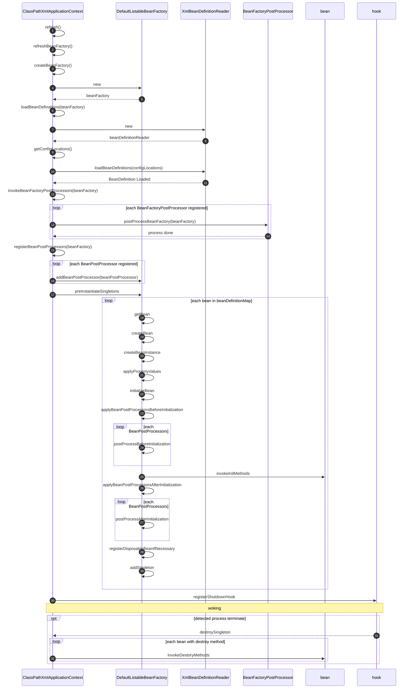

```mermaid
sequenceDiagram
autonumber
    participant cpxac as ClassPathXmlApplicationContext
    participant dlbf as DefaultListableBeanFactory
    participant xbdr as XmlBeanDefinitionReader
    participant bfpp as BeanFactoryPostProcessor
    participant bean
    participant hook
    
    cpxac ->> cpxac : refresh()
    cpxac ->> cpxac : refreshBeanFactory()
    cpxac ->> cpxac : createBeanFactory()
    cpxac ->> dlbf : new
    dlbf -->> cpxac : beanFactory
    cpxac ->> cpxac : loadBeanDefinations(beanFactory)
    cpxac ->> xbdr : new
    xbdr -->> cpxac : beanDefinitionReader
    cpxac ->> cpxac : getConfigLocations()
    cpxac ->> xbdr : loadBeanDefinitions(configLocations)
    xbdr -->> cpxac : BeanDefinition Loaded
    cpxac ->> cpxac : invokeBeanFactoryPostProcessors(beanFactory)
    loop each BeanFactoryPostProcessor registered
        cpxac ->> bfpp : postProcessBeanFactory(beanFactory)
        bfpp -->> cpxac : process done
    end
    cpxac ->> cpxac : registerBeanPostProcessors(beanFactory)
    loop each BeanPostProcessor registered
        cpxac ->> dlbf : addBeanPostProcessor(beanPostProcessor)
    end
    
    cpxac ->> dlbf : preInstantiateSingletons
    loop each bean in beanDefinitionMap
        dlbf ->> dlbf : getBean
        dlbf ->> dlbf : createBean    
        dlbf ->> dlbf : createBeanInstance
        dlbf ->> dlbf : applyPropertyValues
        dlbf ->> dlbf : initializeBean
        dlbf ->> dlbf : applyBeanPostProcessorsBeforeInitialization
        loop each BeanPostProcessors
            dlbf ->> dlbf : postProcessBeforeInitialization
        end
        dlbf ->> bean : invokeInitMethods
        dlbf ->> dlbf : applyBeanPostProcessorsAfterInitialization
        loop each BeanPostProcessors
            dlbf ->> dlbf : postProcessAfterInitialization
        end
        dlbf ->> dlbf : registerDisposableBeanIfNecessary
        dlbf ->> dlbf : addSingleton
    end
    cpxac ->> hook : registerShutdownHook
    
    note over cpxac, hook : woking
    
    opt detected process terminate
        hook -->> cpxac : destroySingleton
        loop each bean with destroy method
            cpxac ->> bean : invokeDestoryMethods
        end
    end
    
```